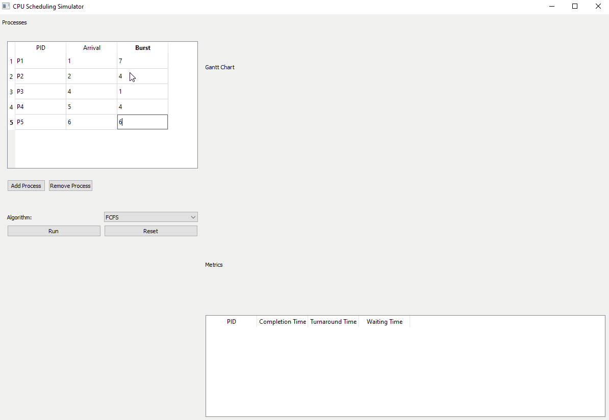
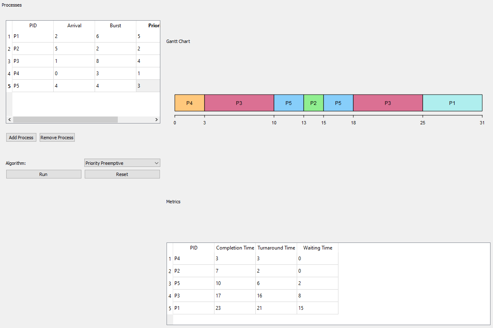
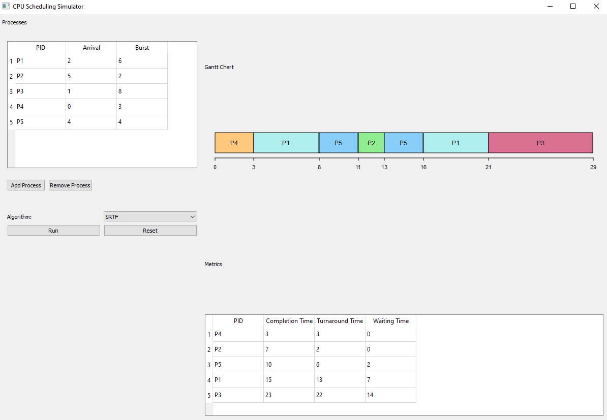
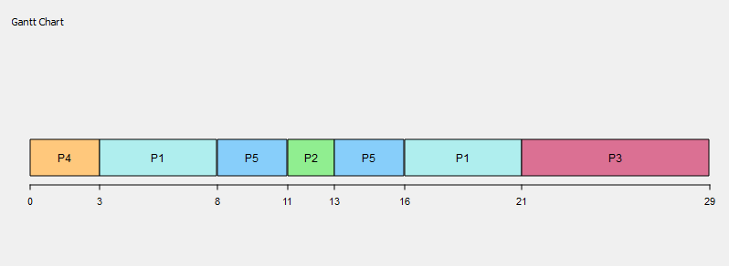

# CPU Scheduling Simulator

An interactive CPU Scheduling Simulator built with Python for visualizing and analyzing classical operating system scheduling algorithms.

The project focuses on:
- CPU scheduling behavior analysis
- process execution visualization
- scheduling performance evaluation
- modular systems-oriented software design
- algorithm simulation and testing

---

# Demo

## Application Demo

Example:



---

## Dashboard Preview

Example:




---

## Gantt Chart Visualization

Example:



---

# Supported Algorithms

- FCFS (First Come First Serve)
- SJF Non-Preemptive
- SRTF (Shortest Remaining Time First)
- Round Robin
- Priority Non-Preemptive
- Priority Preemptive

---

# Features

- Interactive scheduling dashboard
- Process input system
- Algorithm selection dropdown
- Gantt chart visualization
- Waiting Time and Turnaround Time analysis
- Modular algorithm implementations
- Extensive Pytest-based testing
- Edge-case handling
- Scalable project architecture

---

# Project Structure

```bash
cpu-scheduling-simulator/
│
├── algorithms/
│   ├── fcfs.py
│   ├── priority_np.py
│   ├── priority_preemptive.py
│   ├── round_robin.py
│   ├── sjf_non_preemptive.py
│   └── srtf.py
│
├── assets/
│   ├── demo/
│   └── screenshots/
│
├── tests/
│   ├── test_fcfs.py
│   ├── test_priority_np.py
│   ├── test_priority_preemptive.py
│   ├── test_round_robin.py
│   ├── test_sjf_non_preemptive.py
│   └── test_srtf.py
│
├── ui/
│   ├── controls.py
│   ├── dashboard.py
│   ├── gantt_chart.py
│   ├── metrics_table.py
│   └── process_table.py
│
├── main.py
├── requirements.txt
└── README.md
```

---

# How the UI Works

The simulator provides an interactive graphical interface for executing and visualizing CPU scheduling algorithms.

## Running the Application

```bash
python main.py
```

---

# Workflow

## 1. Select Scheduling Algorithm

Choose one of the available algorithms from the dropdown menu:
- FCFS
- SJF
- SRTF
- Round Robin
- Priority Non-Preemptive
- Priority Preemptive

---

## 2. Add Processes

Enter:
- Process ID
- Arrival Time (AT)
- Burst Time (BT)

If using Priority algorithms:
- Enter process priority

If using Round Robin:
- Enter Time Quantum

Then click:

```text
Add Process
```

---

## 3. Run Simulation

Click:

```text
Run
```

The simulator will:
- execute the selected scheduling algorithm
- generate the Gantt chart
- calculate scheduling metrics
- display process statistics

---

# Output Visualization

## Gantt Chart

The Gantt chart visualizes:
- process execution order
- CPU allocation timeline
- preemption behavior
- idle CPU periods

---

## Metrics Table

The metrics table displays:

| PID | Completion Time | Turnaround Time | Waiting Time |
|---|---|---|---|

---

# Example Input

| PID | Arrival Time | Burst Time | Priority |
|---|---|---|---|
| P1 | 0 | 10 | 3 |
| P2 | 3 | 5 | 1 |
| P3 | 5 | 2 | 2 |

---

# Example Output

## Gantt Chart

```text
P1 → P2 → P3
```

## Metrics

| PID | CT | TAT | WT |
|---|---|---|---|
| P1 | 10 | 10 | 0 |
| P2 | 15 | 12 | 7 |
| P3 | 17 | 12 | 10 |

---

# Testing

The project includes extensive unit testing using Pytest.

Current test coverage includes:
- scheduling correctness
- edge-case handling
- idle CPU validation
- preemption validation
- zero burst time handling
- input immutability checks
- large-gap scheduling scenarios

---

## Run Tests

```bash
python -m pytest -v
```

Example result:

```text
64 passed in 3.88s
```

---

# Technologies Used

- Python
- PyQt5
- Pytest
- Git
- GitHub

---

# Installation

## Clone Repository

```bash
git clone https://github.com/muien5080/cpu-scheduling-simulator.git
```

---

## Navigate Into Project

```bash
cd cpu-scheduling-simulator
```

---

## Install Dependencies

```bash
pip install -r requirements.txt
```

---

# Future Improvements

- Real-time animated scheduling visualization
- Scheduling performance comparison graphs
- Export simulation reports
- Additional scheduling algorithms
- Dark mode UI
- Process queue visualization

---

# Learning Objectives

This project was built to strengthen understanding of:
- operating systems concepts
- CPU scheduling
- process management
- systems programming
- simulation systems
- software testing
- modular software architecture

---

# Author

Mohammed Muien

GitHub:
https://github.com/muien5080